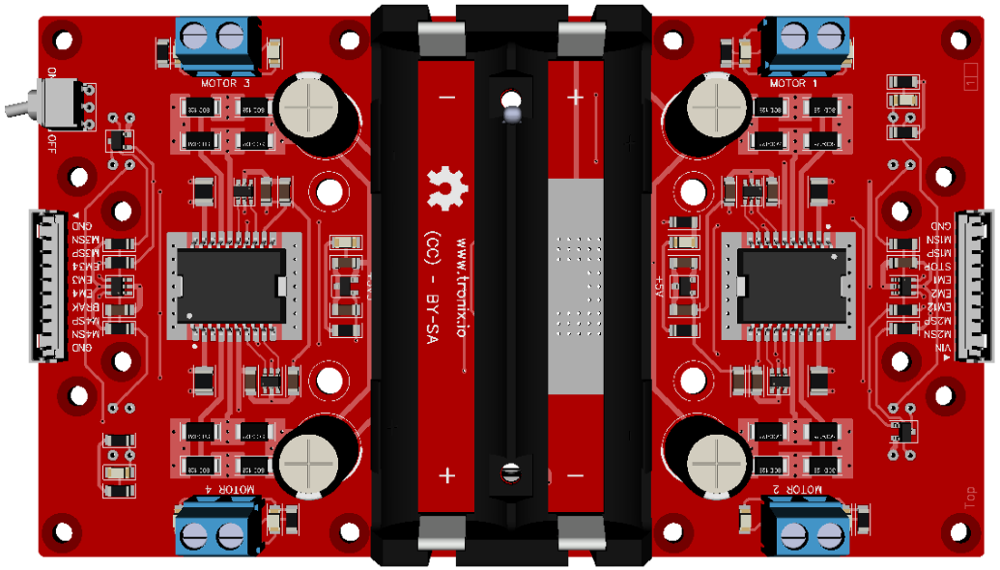
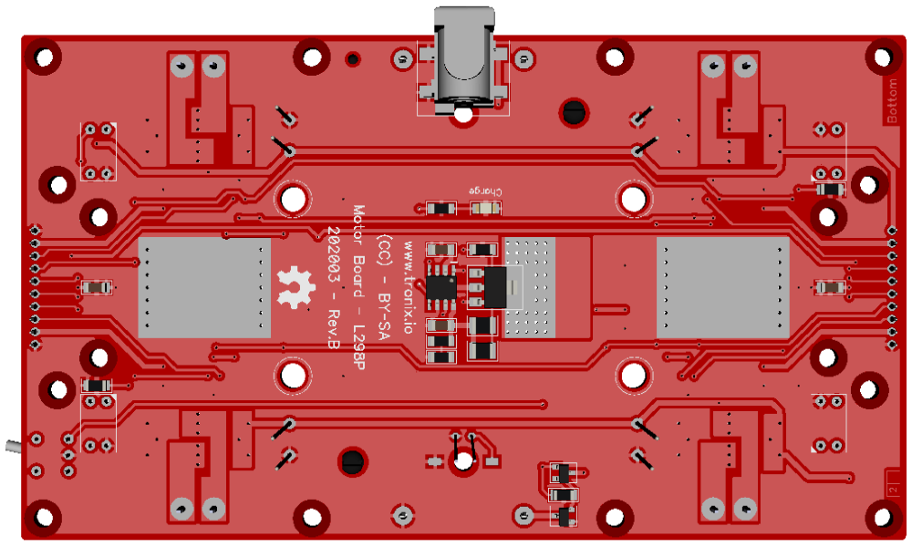

# DRAFT - TCAR 4 Wheels.

## Features.

- 4 Wheels.
- 4 Motors with IR Encoder.
- Power 2Cells 18650 Lithium Ion Rechargeable Batteries, with charger embedded.
- [4WD Mobile Plateform.](https://www.elecrow.com/4wd-mobile-platform-for-arduino-smart-robot-car-p-1531.html)

## Schematics.

- [TODO - MCU Board - Rev.A.](./tcar-mcu.pdf)
- [DRAFT - Motor Board L298P - Rev.B.](./tcar-motor-l298p.pdf)

## Code Examples.

- [DRAFT - Motor test](./pic24fj-motors.md)

## Motor board L298P top.

## Motor board L298P bottom.

---